# AutiCare - Autism Development Tracker

AutiCare is a full-stack platform designed to track daily developmental signals of children with Autism Spectrum Disorder (ASD), support caregivers, and provide AI-assisted insights.

Live preview : [AutiCare]( https://auticare-frontend-289994063131.europe-west1.run.app)

---

## Project Overview

With AutiCare, parents and caregivers can:

- Record child-specific daily behavior logs (eye contact, communication, aggression, sleep)
- Track development trends over time
- Generate AI-powered weekly reports
- Detect potential anomalies
- Manage reminders
- Receive richer support through AI chat and expert-oriented agent workflows

> Note: This application does not provide medical diagnosis and does not replace clinical judgment.

---

## Features

### Core Application Features

- JWT-based authentication and authorization
- Multi-child profile management
- Create/update/delete daily behavior logs
- AI-generated weekly report generation
- Email-enabled reminders
- Dashboard summary cards and trend views

### Agentic AI Features (LangGraph + CrewAI)

- Dynamic routing (different execution paths based on task type)
- Search-enhanced knowledge collection step
- Human-in-the-Loop (HITL) review flow
- Checkpointing and workflow resume support
- Crew-based multi-agent task orchestration
- Monitoring and performance metrics (LangSmith-ready integration)

---

## Tech Stack

### Frontend

- React 18
- TypeScript
- Vite
- React Router DOM
- Axios
- Tailwind CSS

### Backend

- FastAPI
- SQLAlchemy
- MySQL
- APScheduler
- Python-Jose + bcrypt
- OpenAI SDK
- CrewAI
- LangGraph
- LangChain / LangChain OpenAI
- LangSmith

### DevOps & Infrastructure

- Docker + Docker Compose
- Cloud Build (`cloudbuild.yaml`)
- Google Cloud Run deployment flow

---

## 🤖 Advanced Agentic AI Architecture

AutiCare utilizes a state-of-the-art hybrid AI architecture combining **LangGraph**, **CrewAI**, and **MCP** to provide safe, dynamic, and expert-level analysis.

### 1. LangGraph: The Orchestrator (The Brain) 🧠
LangGraph acts as the central decision-making engine for all AI operations.
- **Dynamic Routing:** When a request comes in (e.g., "analyze this data" or "generate a report"), LangGraph analyzes the user's intent and dynamically decides the execution path.
- **Search Integration:** If the request requires up-to-date knowledge, it routes to a web search node before analysis.
- **Human-in-the-Loop (HITL):** LangGraph calculates a confidence score. If the score is low or the task involves medical/therapy advice, the workflow is paused (`interrupt_before=["human_review"]`). It waits for a specialist's approval before returning the result to the user.

### 2. CrewAI: The Domain Experts (The Workers) 👷‍♂️
Once LangGraph decides *what* needs to be done, **CrewAI** is responsible for *doing* it. CrewAI manages a team of specialized AI agents:
- `BehavioralAnalystAgent`: Analyzes behavior trends.
- `AnomalyDetectorAgent`: Detects unusual deviations in sleep, aggression, etc.
- `TherapyAdvisorAgent`: Recommends therapy activities.
- `ReportGeneratorAgent`: Synthesizes the weekly reports.
- `LiteratureReviewAgent`: Searches for the latest academic evidence.
Instead of a single AI model trying to do everything, these specialized agents collaborate, share context, and produce highly accurate, domain-specific outputs.

### 3. MCP (Model Context Protocol): The External Bridge 🌉
AutiCare features a native **MCP Server** integration.
- **What it does:** MCP allows external AI assistants (like the **Claude Desktop App**) to securely connect to the AutiCare database in real-time.
- **How it works:** Instead of relying on pre-compiled reports, you can ask Claude directly: *"Get the last 7 days of logs for Ali."* Claude will use the custom MCP tools (`get_child_logs`, `query_child_metrics`) to fetch live data from your database and generate insights on the fly.
- **Security:** Tool calls are never direct DB queries. The MCP bridge enforces strict ownership checks (`parent_id`, `child_id`) so users can only access their own children's data.

### End-to-End Flow
`Intent Analysis` ➡️ `Information Search (if needed)` ➡️ `CrewAI Multi-Agent Analysis` ➡️ `Human Review (if critical)` ➡️ `Final Output`

---

## API Endpoints (Quick Guide)

Swagger docs: `http://localhost:8000/docs`

### Auth

- `POST /auth/register`
- `POST /auth/login`
- `GET /auth/me`
- `PUT /auth/me`

### Child & Log Management

- `GET/POST/PUT/DELETE /children`
- `GET/POST/PUT/DELETE /logs`
- `GET/POST /reports`
- `GET/POST/PUT/DELETE /reminders`

### AI & Workflow

- `POST /ai/chat/{child_id}` (legacy compatibility endpoint)
- `GET /ai/anomaly/{child_id}` (legacy compatibility endpoint)
- `POST /ai/v2/workflow/{child_id}` (LangGraph hybrid workflow)
- `GET /ai/v2/workflow/info`
- `GET /ai/v2/monitoring/stats`
- `POST /ai/v2/crew/{crew_type}/{child_id}`

### MCP Integration (New)

- `GET /mcp/tools` (list available MCP tools for authenticated user)
- `POST /mcp/call` (invoke a tool safely with ownership checks)
- `POST /mcp/advisor` (conversational advisor endpoint using MCP tools)
- `GET /mcp/advisor/stream` (SSE-based streaming advisor response for chat UI)

`/mcp/call` example body:

```json
{
  "tool_name": "query_child_metrics",
  "arguments": {
    "child_id": 1,
    "metric": "sleep_hours",
    "days": 30
  }
}
```

`/mcp/advisor/stream` example request:

```text
GET /mcp/advisor/stream?token=<JWT>&child_id=1&message=Bu%20hafta%20uyku%20duzeni%20nasil
```

SSE event shape:

```json
{ "type": "start" }
{ "type": "chunk", "text": "..." }
{ "type": "done", "tool_result": { "...": "..." } }
```

### Human-in-the-Loop (Admin)

- `GET /ai/v2/reviews/{child_id}`
- `GET /ai/v2/reviews/all/{child_id}`
- `PUT /ai/v2/reviews/{review_id}`
- `POST /ai/v2/reviews/create`

---

## Project Structure

```text
autism-tracker/
├── backend/
│   ├── app/
│   │   ├── main.py
│   │   ├── workflow.py
│   │   ├── crew_manager.py
│   │   ├── workflow_nodes.py
│   │   ├── tools.py
│   │   ├── routers/
│   │   │   └── mcp.py
│   │   ├── models/
│   │   └── services/
│   │       └── mcp_server.py
│   ├── Dockerfile
│   ├── requirements.txt
│   └── run_mcp_server.py
├── frontend/
│   ├── src/
│   │   ├── api/
│   │   │   └── ai.ts
│   │   └── pages/
│   │       └── Dashboard.tsx
│   └── package.json
├── docker-compose.yml
├── cloudbuild.yaml
└── README.md
```

---

## Setup (Local Development)

### Requirements

- Docker Desktop
- Node.js 18+
- Python 3.11+

### 1) Clone the repository

```bash
git clone https://github.com/dilangulerx/AutiCare.git
cd autism-tracker
```

### 2) Prepare backend environment variables

Create your `backend/.env` file according to your local setup.

Example:

```env
DATABASE_URL=mysql+pymysql://root:rootpassword@db:3306/autism_tracker
SECRET_KEY=change-me-in-production
OPENAI_API_KEY=your_openai_key
RESEND_API_KEY=your_resend_key
```

### 3) Start backend + database

```bash
docker-compose up -d
```

Backend: `http://localhost:8000`  
Docs: `http://localhost:8000/docs`  
MySQL: `localhost:3307`

### 4) Start frontend

```bash
cd frontend
npm install
npm run dev
```

Frontend: `http://localhost:5173`

### 5) (Optional) Run native MCP stdio server

If you want to connect an external MCP-capable agent runtime directly:

```bash
cd backend
pip install -r requirements.txt
python run_mcp_server.py
```

This starts an MCP stdio server that exposes:

- `get_child_logs`
- `query_child_metrics`
- `get_weekly_summary`
- `add_reminder`
- `generate_therapy_brief`

### 6) Validate streaming chat integration

After backend + frontend are running:

1. Login from UI
2. Open Dashboard -> `AI Asistan`
3. Send a question like: `Bu hafta uyku duzeni nasil?`
4. You should see answer text streamed progressively
5. If stream is unavailable, the app automatically uses legacy chat endpoint

---

## Google Cloud Deployment Notes

This repository includes Cloud Build configuration: `cloudbuild.yaml`

Recommended simple production flow:

1. Work from the `deploy/prod` branch
2. In Cloud Run, choose "Continuously deploy from repository"
3. Select branch `deploy/prod`
4. Set Dockerfile path to `backend/Dockerfile`
5. Manage secrets with Secret Manager

---

## Docker Commands

```bash
docker-compose up -d
docker-compose logs -f
docker-compose restart backend
docker-compose down
docker exec -it autism_db mysql -u root -prootpassword autism_tracker
```

---

## Database Summary

- `users`
- `children`
- `daily_logs`
- `weekly_reports`
- `reminders`
- `human_reviews` (HITL review records)

---

## Screenshots

### Login & Register
| Login Page | Register Page |
|------------|---------------|
| 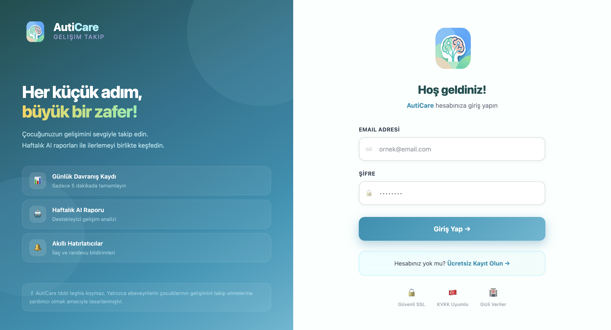 | 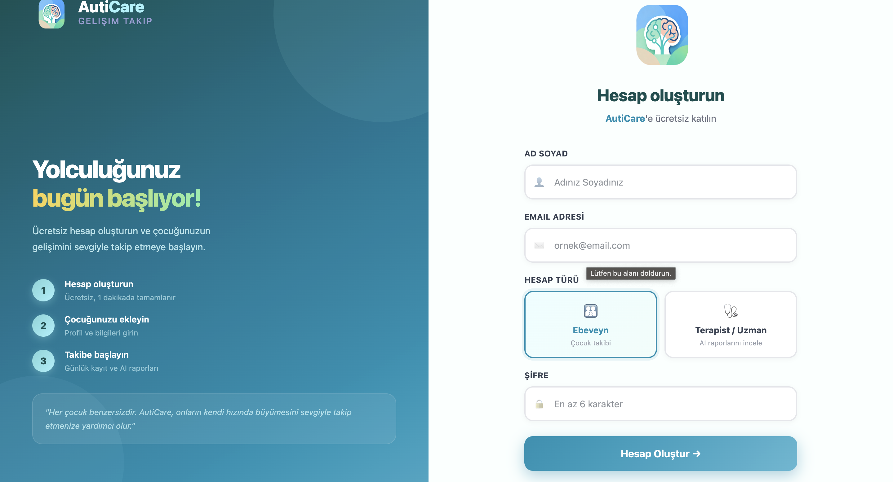 |

### Dashboard & Navigation
> Ana kontrol paneli ve henüz çocuk eklenmemiş görünüm.

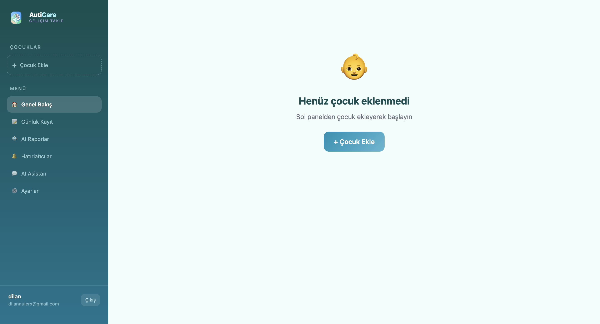
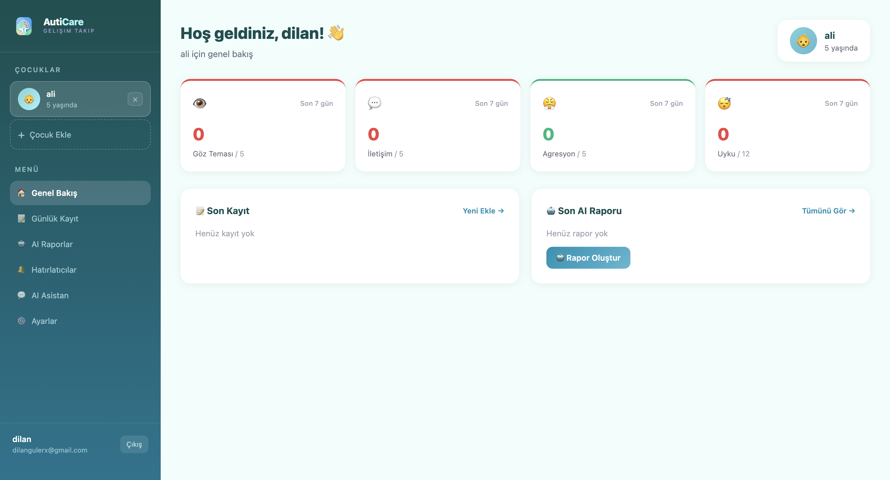

### Daily Records (Günlük Kayıt)
> Göz teması, iletişim skoru ve agresyon seviyesi gibi verilerin giriş ekranı.

| Scores and Sleep | Clinical Observation and Details | ABC Record and Notes |
|:---:|:---:|:---:|
| 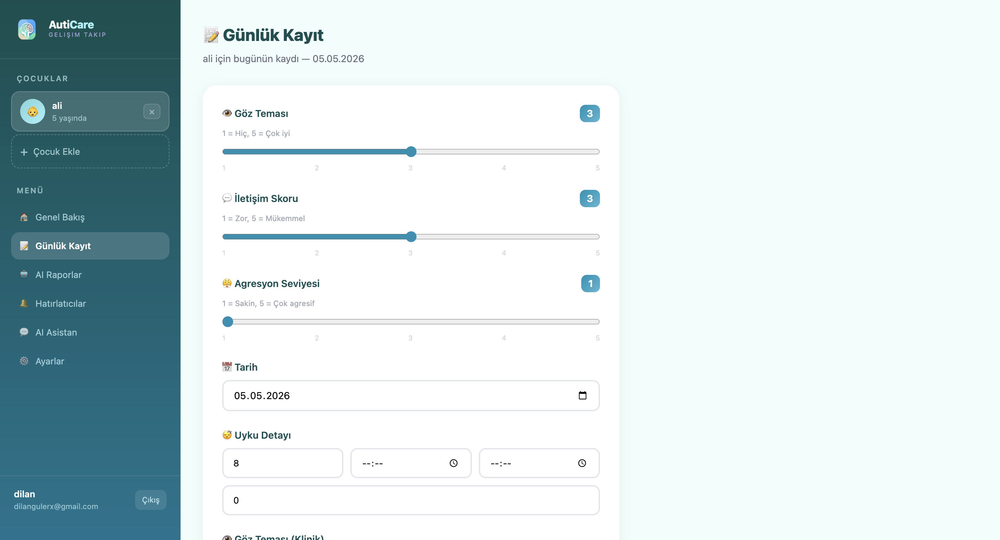 | 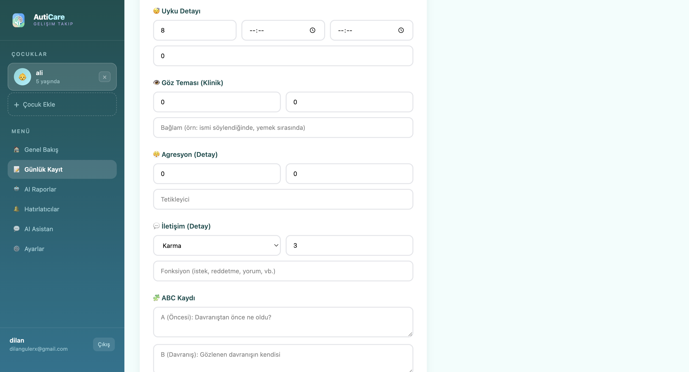 | 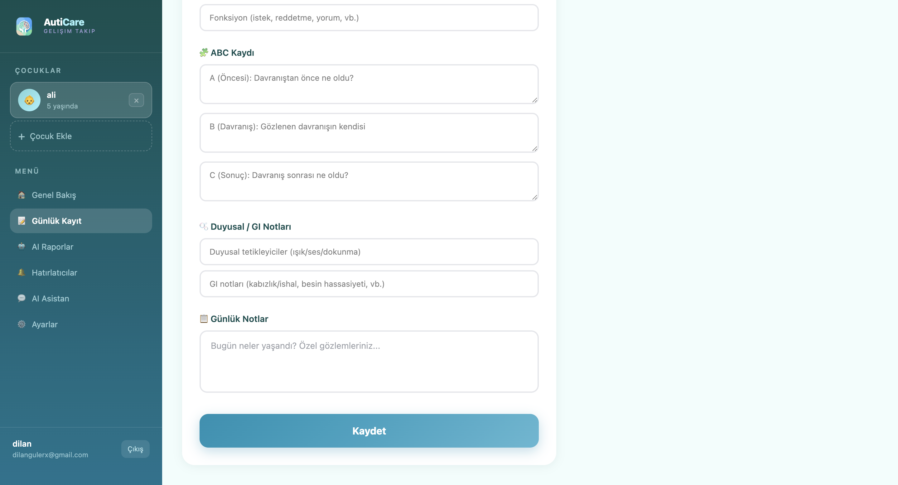 |

### AI Features (Artificial Intelligence Features)
> Advanced AI-driven insights, chat, and expert approval workflows.

#### AI Assistant (Chat)
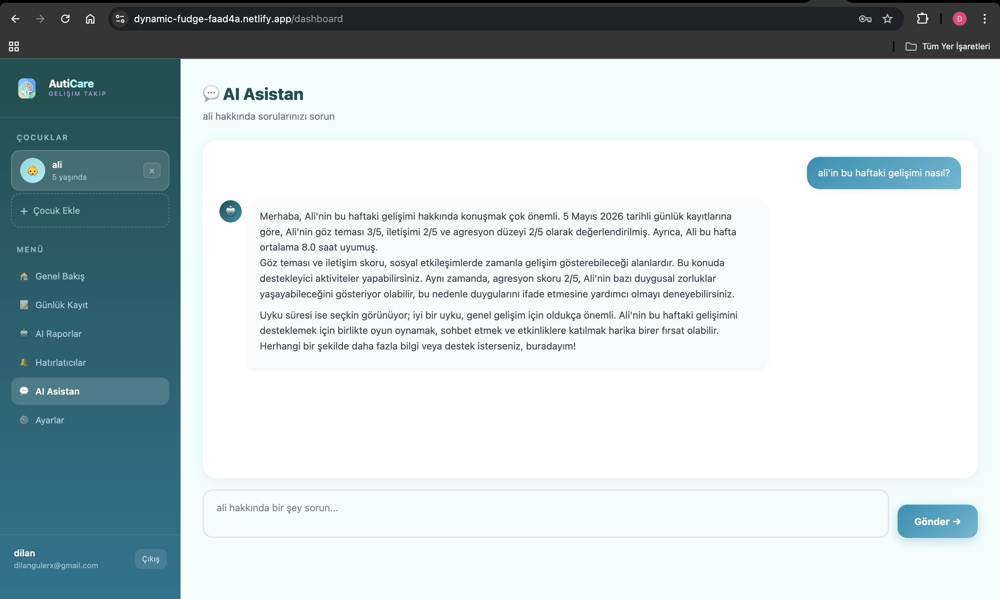

#### AI Reports & Analysis
| Report List | Report Detail |
|:---:|:---:|
| 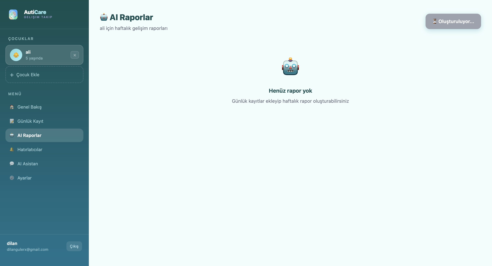 | 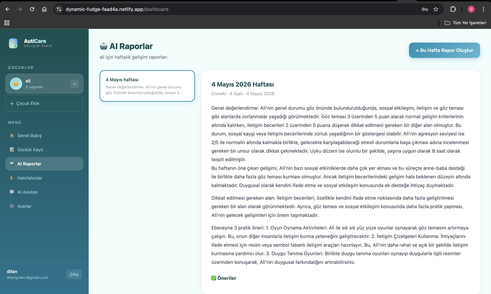 |

#### AI Approval Panel (HITL)
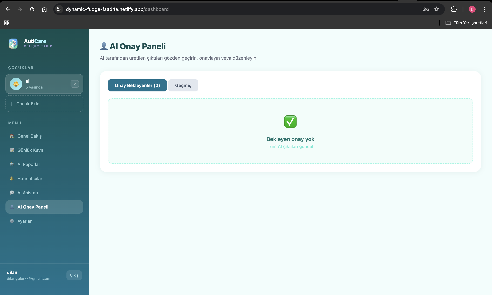

#### MCP Integration (Claude Desktop)
> Real-time data access for external AI assistants via Model Context Protocol.

| Claude Interaction 1 | Claude Interaction 2 |
|:---:|:---:|
| 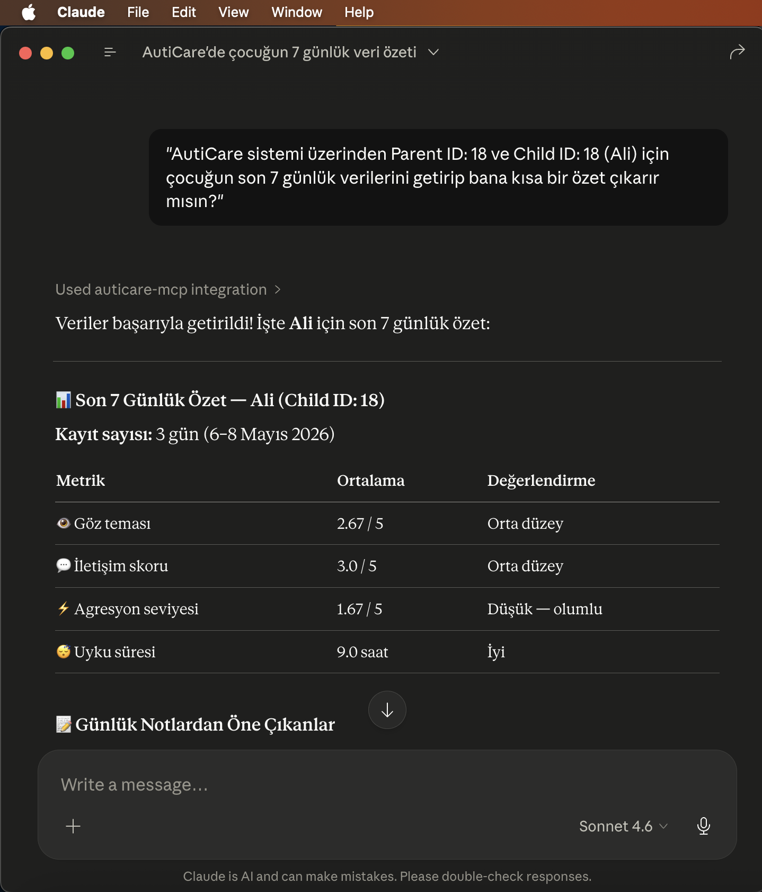 | 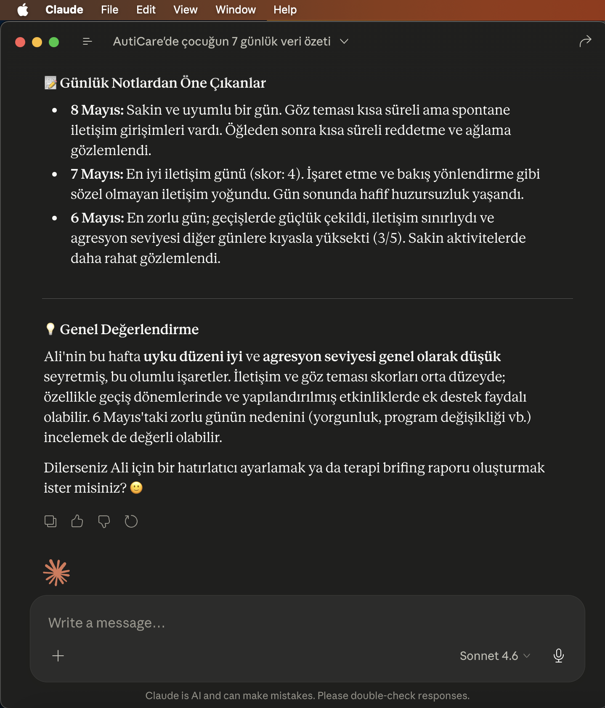 |

### Reminders
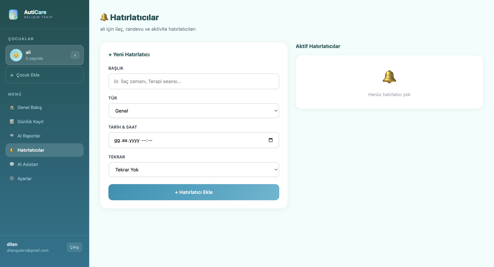

### Settings
> Profile management, security, and application preferences.

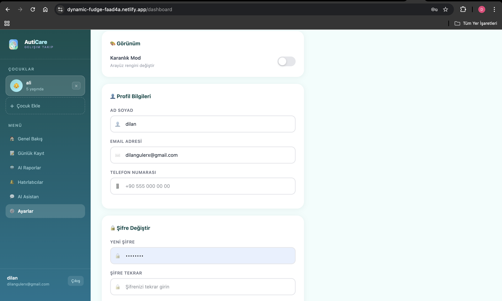

---

## License

This project was created for educational and product development purposes.

---

## Disclaimer

AutiCare is not a medical device and does not provide clinical diagnosis or treatment. AI outputs are informational and should be reviewed with qualified professionals.

## Author

Developed by [Dilan Güler](https://github.com/dilangulerx)
